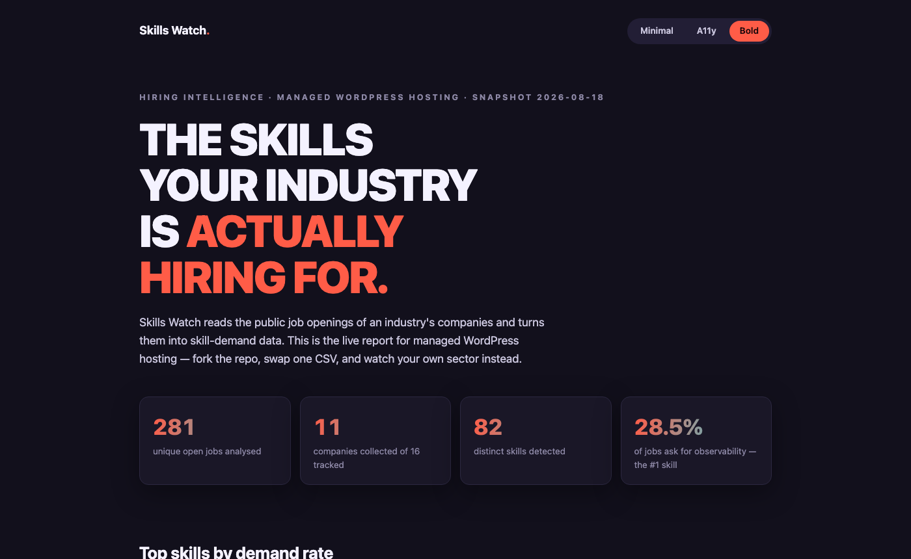

# Skills Watch

> Turn public company job openings into structured hiring, skill and technology intelligence.



**[View the live report →](https://deshabhishek007.github.io/skills-watch/)** — three
styles (Minimal, A11y, Bold), switchable on the page or via `?skin=bold`. The page
ships in [`docs/index.html`](docs/index.html) so your fork gets its own.

Point it at a CSV of companies — WordPress hosts, banks, SaaS vendors, any
competitive set — and it collects their open jobs from official careers sources,
extracts and normalises skills, and produces CSV datasets plus a Markdown
research report. Dated snapshots make every run comparable with the last, so you
can watch skill demand shift in your industry over time.

The first published dataset here tracks the **Managed WordPress Hosting**
industry: see [`output/report.md`](output/report.md) and the history in
[`snapshots/`](snapshots/).

## Quick start

```bash
git clone https://github.com/deshabhishek007/skills-watch && cd skills-watch
python3 -m venv .venv && .venv/bin/pip install -e ".[dev]"

.venv/bin/python -m skills_watch analyse \
  --companies companies/managed-wordpress-hosting.csv \
  --snapshot
```

Outputs land in `output/` (see below); `--snapshot` also archives them to
`snapshots/<date>/`.

Useful flags: `--company X` / `--sector Y` (restrict the run),
`--snapshot-date YYYY-MM-DD`, `--force-snapshot` (same-day re-run), `--no-report`.

## Watch your own industry (fork this)

This repo is designed to be forked for personal use. The Managed WordPress
Hosting dataset is just the demo — your fork watches whatever sector you care
about.

1. **Fork and clone**, then install (see Quick start).
2. **Create your company list**, e.g. `companies/my-sector.csv`. Only the
   `company` column is required:

   ```csv
   company,website,careers_url,sector,enabled,notes,source_type,source_ref
   Acme Corp,https://acme.com,https://acme.com/careers,SaaS,true,,greenhouse,acmecorp
   ```

3. **Run it:**

   ```bash
   .venv/bin/python -m skills_watch analyse --companies companies/my-sector.csv --snapshot
   ```

4. **Commit the results.** `output/` and `snapshots/<date>/` are meant to be
   committed — that's your history, and the next run diffs against it.
5. **Optionally schedule it** so snapshots accrue. This repo includes a Claude
   Code routine (`routines/skills-watch.md`) that runs the pipeline,
   quality-checks the results, writes the report narrative, and commits the
   snapshot. Schedule it with a **local** Claude Code scheduled task (ask
   Claude to "run routines/skills-watch.md on the 1st and 15th"), or plain
   cron — the pipeline itself needs no LLM. Biweekly is a good cadence: many
   postings live only a few weeks, so monthly runs miss short-lived vacancies,
   while biweekly keeps snapshot-to-snapshot changes meaningful. Note that
   Claude's *cloud* scheduled agents currently can't run the collection —
   their sandbox blocks outbound requests to careers sites — so schedule
   somewhere with normal internet access (your machine or your own CI).

### Adding a company — three levels

Each row works at whatever level of detail you have:

- **Just a name.** The row is valid, but until you add a `careers_url` there is
  nothing to collect, and the run reports it as `failed` rather than guessing.
- **Name + `careers_url`.** The `generic` collector scrapes the page
  best-effort. If the page merely embeds a known ATS board, the run stops that
  company with an `unsupported: page embeds ATS …` message telling you exactly
  what to put in `source_type`/`source_ref`.
- **Name + `source_type` + `source_ref`** (best). Uses the ATS's structured
  JSON API: stable job IDs, locations, departments, full descriptions.

**How to find a company's ATS in 30 seconds:** open their careers page, click
any job posting, and look at the URL you land on (or the Apply link):

| URL looks like | `source_type` | `source_ref` |
|---|---|---|
| `boards.greenhouse.io/acme` or `job-boards.greenhouse.io/acme` | `greenhouse` | `acme` |
| `jobs.lever.co/acme/...` | `lever` | `acme` |
| `acme.wd1.myworkdayjobs.com/en-US/External/...` | `workday` | `acme.wd1.myworkdayjobs.com\|External` |
| `apply.workable.com/acme/j/...` | `workable` | `acme` |
| `acme.bamboohr.com/careers/...` | `bamboohr` | `acme` |
| none of the above | `generic` | *(leave empty)* |

Slugs aren't always the obvious company name (Rocket.net's Workable slug is
`rocket-dot-n-et`), so always copy it from a real job URL rather than guessing.

You can mix sectors in one CSV — fill the `sector` column and each sector is
aggregated separately in `sector_summary.csv` / `sector_skills.csv`. Set
`enabled=false` to park a company without deleting the row.

## Check your own skill gap

Once a run has produced sector data, compare it against **your** skills to see
what you're strong in and what to learn next:

```bash
cp profile/my-skills.example.yml profile/my-skills.yml   # edit with your skills
.venv/bin/python -m skills_watch gap --skills profile/my-skills.yml
```

Write skills in your own words — aliases work ("K8s", "GCP", "WP"). The result,
`output/skill_gap.md`, has three parts:

- **Skills you have that the market wants** — your skills ranked by how often
  the sector's vacancies mention them.
- **Skills to focus on** — the highest-demand skills *not* on your list; once
  two snapshots exist, each shows its demand trend so you can prioritise what's
  rising.
- **Not recognised** — anything that didn't match the taxonomy (add real skills
  to `taxonomy/skills.yml`).

`profile/my-skills.yml` is gitignored, so your personal skill list stays out of
your public fork.

## Supported collectors

| `source_type` | `source_ref` | Source |
|---|---|---|
| `greenhouse` | board token | `boards-api.greenhouse.io/v1/boards/{token}/jobs` |
| `lever` | account | `api.lever.co/v0/postings/{account}` |
| `workday` | `host\|site`, e.g. `acme.wd1.myworkdayjobs.com\|External` | Workday CXS JSON API |
| `workable` | account | `apply.workable.com/api/v3/accounts/{account}` |
| `bamboohr` | subdomain | `{sub}.bamboohr.com/careers/list` |
| `generic` | — | best-effort HTML scrape of `careers_url` |

Adding an ATS = one small class in `src/skills_watch/collectors/` with the
`@register` decorator returning the common `Job` schema. Contributions welcome.

## Outputs

| File | Contents |
|---|---|
| `jobs.csv` | every unique vacancy with extracted skills, function, seniority, remote status |
| `company_summary.csv`, `company_skills.csv` | per-company hiring stats and skill demand rates |
| `sector_summary.csv`, `sector_skills.csv` | sector-level aggregation |
| `technology_matrix.csv` | company × technology demand-rate matrix |
| `collection_status.csv` | per-company collection outcome — failures are never counted as zero hiring |
| `skill_trends.csv`, `company_hiring_trends.csv` | changes vs the previous snapshot (when one exists) |
| `report.md` | the human-readable research report |

## Skill methodology

The headline metric is the **skill demand rate**:

```
unique jobs mentioning skill / total unique jobs analysed × 100
```

Skills are matched against a curated taxonomy (`taxonomy/skills.yml`) with
word-boundary matching and alias normalisation (`taxonomy/skill_aliases.yml` —
"K8s" and "Kubernetes" are one skill). A job mentioning a skill ten times counts
once. Raw keyword frequency is never used. To tune extraction for your industry,
edit the YAML files — no code changes needed.

## Historical snapshots

Every `--snapshot` run archives the outputs to `snapshots/<date>/`, which is
committed to git and never overwritten. When at least one prior snapshot exists,
the next run automatically reports new/removed jobs per company and
percentage-point changes in skill demand.

## Limitations

- Job postings are **hiring signals**, not proof of a company's internal stack
  or strategy.
- The `generic` collector is best-effort; JavaScript-rendered careers sites
  come back `failed`/`unsupported` and are excluded from the stats (and say so).
- Employers sometimes post one listing for several openings, or several
  listings for one opening; stable ATS IDs limit but don't eliminate this.
- Diversified companies (a registrar that also does hosting) contribute their
  whole hiring pipeline, not just the segment you're watching.

## Ethics

Official careers sources only, ~1.5s between requests, day-scoped response
cache, honest User-Agent, no authentication or anti-bot circumvention, no
applicant or employee personal data — vacancy text only.
