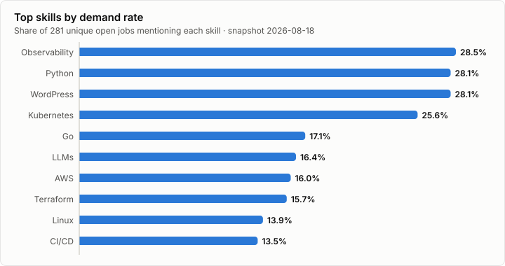

# Skills Watch: Managed WordPress Hosting

*Snapshot date: 2026-08-18 · 281 unique open jobs across 11 companies*

## Methodology

Public job postings were collected from official careers sources for 16 companies. Postings were deduplicated (stable ATS job IDs where available), and skills were matched against a curated taxonomy with alias normalisation. The headline metric is the **skill demand rate**: the percentage of unique analysed jobs that mention a skill — a job mentioning a skill many times still counts once. Job postings are hiring signals; they do not prove what technology a company runs in production, and collection failures are reported separately rather than counted as zero hiring.

## Collection Status

| Company | Status | Jobs | Source |
|---|---|---|---|
| WP Engine | success | 11 | workday |
| Automattic | success | 19 | automattic |
| Pressable | success | 2 | greenhouse |
| Pantheon | success | 30 | greenhouse |
| Kinsta | success | 3 | lever |
| SiteGround | success | 2 | lever |
| Liquid Web | no_open_jobs | 0 | generic |
| GoDaddy | success | 26 | greenhouse |
| DigitalOcean | success | 143 | greenhouse |
| Newfold Digital | success | 40 | workday |
| Rocket.net | success | 3 | workable |
| Servebolt | success | 2 | generic |
| GridPane | no_open_jobs | 0 | generic |
| Convesio | disabled | 0 | — |
| 10Web | no_open_jobs | 0 | bamboohr |
| WPX Hosting | no_open_jobs | 0 | generic |

## Top Skills

Share of all analysed jobs that mention each skill:

| Skill | Category | Jobs | Demand rate |
|---|---|---|---|
| Observability | Infrastructure | 80 | 28.5% |
| Python | Programming | 79 | 28.1% |
| WordPress | WordPress | 79 | 28.1% |
| Kubernetes | Infrastructure | 72 | 25.6% |
| Go | Programming | 48 | 17.1% |
| LLMs | AI | 46 | 16.4% |
| AWS | Cloud | 45 | 16.0% |
| Terraform | Infrastructure | 44 | 15.7% |
| Linux | Infrastructure | 39 | 13.9% |
| CI/CD | Infrastructure | 38 | 13.5% |
| Google Cloud | Cloud | 37 | 13.2% |
| Product Management | Business | 36 | 12.8% |
| SQL | Data | 35 | 12.5% |
| Incident Response | Security | 34 | 12.1% |
| JavaScript | Programming | 32 | 11.4% |
| Node.js | Programming | 32 | 11.4% |
| MySQL | Data | 31 | 11.0% |
| Salesforce | Business | 31 | 11.0% |
| Microsoft Azure | Cloud | 28 | 10.0% |
| Customer Success | Business | 27 | 9.6% |
| Technical Support | Business | 25 | 8.9% |
| Account Management | Business | 23 | 8.2% |
| Git | Infrastructure | 21 | 7.5% |
| WooCommerce | WordPress | 21 | 7.5% |
| Docker | Infrastructure | 20 | 7.1% |

## Top Technologies

| Technology | Category | Jobs | Demand rate |
|---|---|---|---|
| Observability | Infrastructure | 80 | 28.5% |
| Python | Programming | 79 | 28.1% |
| WordPress | WordPress | 79 | 28.1% |
| Kubernetes | Infrastructure | 72 | 25.6% |
| Go | Programming | 48 | 17.1% |
| LLMs | AI | 46 | 16.4% |
| AWS | Cloud | 45 | 16.0% |
| Terraform | Infrastructure | 44 | 15.7% |
| Linux | Infrastructure | 39 | 13.9% |
| CI/CD | Infrastructure | 38 | 13.5% |
| Google Cloud | Cloud | 37 | 13.2% |
| SQL | Data | 35 | 12.5% |
| Incident Response | Security | 34 | 12.1% |
| JavaScript | Programming | 32 | 11.4% |
| Node.js | Programming | 32 | 11.4% |
| MySQL | Data | 31 | 11.0% |
| Microsoft Azure | Cloud | 28 | 10.0% |
| Git | Infrastructure | 21 | 7.5% |
| WooCommerce | WordPress | 21 | 7.5% |
| Docker | Infrastructure | 20 | 7.1% |

## Hiring by Company

| Company | Open jobs | Top function | Top skills |
|---|---|---|---|
| DigitalOcean | 143 | Engineering | Kubernetes, Python, Observability, Go, LLMs |
| Newfold Digital | 40 | Sales | WordPress, SEO, DNS, Technical Support, Kubernetes |
| Pantheon | 30 | Engineering | WordPress, Google Cloud, Python, JavaScript, AWS |
| GoDaddy | 26 | Engineering | Observability, AWS, LLMs, Python, CI/CD |
| Automattic | 19 | Sales | WooCommerce, WordPress, Salesforce, WordPress VIP, Customer Success |
| WP Engine | 11 | Other | WordPress, Salesforce, Account Management, Python, SQL |
| Kinsta | 3 | Design | WordPress, CDN, DNS, HubSpot, JavaScript |
| Rocket.net | 3 | Customer Support | Apache, CDN, Cloudflare, DNS, Linux |
| Pressable | 2 | Sales | Account Management, HubSpot, WooCommerce, WordPress |
| SiteGround | 2 | Design | JavaScript, React, TypeScript |
| Servebolt | 2 | Finance | Apache, Ansible, Bash, CI/CD, DNS |

## Skills by Company

### DigitalOcean — 143 jobs

| Skill | Jobs | Demand rate |
|---|---|---|
| Kubernetes | 52 | 36.4% |
| Python | 51 | 35.7% |
| Observability | 49 | 34.3% |
| Go | 35 | 24.5% |
| LLMs | 32 | 22.4% |
| Terraform | 29 | 20.3% |
| Linux | 27 | 18.9% |
| Google Cloud | 24 | 16.8% |

### Newfold Digital — 40 jobs

| Skill | Jobs | Demand rate |
|---|---|---|
| WordPress | 12 | 30.0% |
| SEO | 9 | 22.5% |
| DNS | 6 | 15.0% |
| Technical Support | 6 | 15.0% |
| Kubernetes | 5 | 12.5% |
| Observability | 5 | 12.5% |
| Partnerships | 5 | 12.5% |
| Python | 5 | 12.5% |

### Pantheon — 30 jobs

| Skill | Jobs | Demand rate |
|---|---|---|
| WordPress | 29 | 96.7% |
| Google Cloud | 8 | 26.7% |
| Python | 8 | 26.7% |
| JavaScript | 7 | 23.3% |
| AWS | 6 | 20.0% |
| CI/CD | 6 | 20.0% |
| Kubernetes | 6 | 20.0% |
| Snowflake | 6 | 20.0% |

### GoDaddy — 26 jobs

| Skill | Jobs | Demand rate |
|---|---|---|
| Observability | 12 | 46.2% |
| AWS | 11 | 42.3% |
| LLMs | 10 | 38.5% |
| Python | 10 | 38.5% |
| CI/CD | 9 | 34.6% |
| Incident Response | 7 | 26.9% |
| Kubernetes | 7 | 26.9% |
| Java | 5 | 19.2% |

### Automattic — 19 jobs

| Skill | Jobs | Demand rate |
|---|---|---|
| WooCommerce | 19 | 100.0% |
| WordPress | 19 | 100.0% |
| Salesforce | 8 | 42.1% |
| WordPress VIP | 8 | 42.1% |
| Customer Success | 6 | 31.6% |
| PHP | 6 | 31.6% |
| Account Management | 4 | 21.1% |
| Partnerships | 4 | 21.1% |

### WP Engine — 11 jobs

| Skill | Jobs | Demand rate |
|---|---|---|
| WordPress | 11 | 100.0% |
| Salesforce | 6 | 54.5% |
| Account Management | 4 | 36.4% |
| Python | 3 | 27.3% |
| SQL | 3 | 27.3% |
| AWS | 2 | 18.2% |
| CI/CD | 2 | 18.2% |
| Customer Success | 2 | 18.2% |

### Kinsta — 3 jobs ⚠️ *small sample (3 jobs) — treat rates as indicative only*

| Skill | Jobs | Demand rate |
|---|---|---|
| WordPress | 3 | 100.0% |
| CDN | 1 | 33.3% |
| DNS | 1 | 33.3% |
| HubSpot | 1 | 33.3% |
| JavaScript | 1 | 33.3% |
| Linux | 1 | 33.3% |
| MariaDB | 1 | 33.3% |
| MySQL | 1 | 33.3% |

### Rocket.net — 3 jobs ⚠️ *small sample (3 jobs) — treat rates as indicative only*

| Skill | Jobs | Demand rate |
|---|---|---|
| Apache | 3 | 100.0% |
| CDN | 3 | 100.0% |
| Cloudflare | 3 | 100.0% |
| DNS | 3 | 100.0% |
| Linux | 3 | 100.0% |
| MySQL | 3 | 100.0% |
| Nginx | 3 | 100.0% |
| PHP | 3 | 100.0% |

### Pressable — 2 jobs ⚠️ *small sample (2 jobs) — treat rates as indicative only*

| Skill | Jobs | Demand rate |
|---|---|---|
| Account Management | 2 | 100.0% |
| HubSpot | 2 | 100.0% |
| WooCommerce | 2 | 100.0% |
| WordPress | 2 | 100.0% |

### SiteGround — 2 jobs ⚠️ *small sample (2 jobs) — treat rates as indicative only*

| Skill | Jobs | Demand rate |
|---|---|---|
| JavaScript | 1 | 50.0% |
| React | 1 | 50.0% |
| TypeScript | 1 | 50.0% |

### Servebolt — 2 jobs ⚠️ *small sample (2 jobs) — treat rates as indicative only*

| Skill | Jobs | Demand rate |
|---|---|---|
| Apache | 2 | 100.0% |
| Ansible | 1 | 50.0% |
| Bash | 1 | 50.0% |
| CI/CD | 1 | 50.0% |
| DNS | 1 | 50.0% |
| Go | 1 | 50.0% |
| Incident Response | 1 | 50.0% |
| Linux | 1 | 50.0% |

## Job Function Analysis

| Function | Jobs | Share |
|---|---|---|
| Engineering | 59 | 21.0% |
| Sales | 34 | 12.1% |
| Infrastructure / SRE | 31 | 11.0% |
| Marketing | 26 | 9.3% |
| AI / Machine Learning | 24 | 8.5% |
| Security | 23 | 8.2% |
| Other | 15 | 5.3% |
| Product | 13 | 4.6% |
| Customer Support | 12 | 4.3% |
| Customer Success | 10 | 3.6% |
| Finance | 8 | 2.8% |
| Operations | 7 | 2.5% |
| Design | 6 | 2.1% |
| Legal / Compliance | 5 | 1.8% |
| Data / Analytics | 4 | 1.4% |
| HR / People | 4 | 1.4% |

## Seniority Mix

| Level | Jobs | Share |
|---|---|---|
| Manager | 70 | 24.9% |
| Senior | 69 | 24.6% |
| Unknown | 54 | 19.2% |
| Lead / Staff | 45 | 16.0% |
| Director | 24 | 8.5% |
| Mid Level | 10 | 3.6% |
| Entry Level | 8 | 2.8% |
| Executive | 1 | 0.4% |

## Remote Work Analysis

| Arrangement | Jobs | Share |
|---|---|---|
| On-site | 206 | 73.3% |
| Remote | 53 | 18.9% |
| Unknown | 20 | 7.1% |
| Hybrid | 2 | 0.7% |

## Location Analysis

Coarse geography inferred from raw location text (raw text preserved in `jobs.csv`):

| Region | Jobs | Share |
|---|---|---|
| Other | 118 | 42.0% |
| India | 56 | 19.9% |
| United States | 45 | 16.0% |
| Unknown | 21 | 7.5% |
| Canada | 13 | 4.6% |
| APAC | 13 | 4.6% |
| Europe | 8 | 2.8% |
| Latin America | 6 | 2.1% |
| United Kingdom | 1 | 0.4% |

## Notable Hiring Signals

- **Infrastructure skills lead the industry.** Observability (28.5%), Kubernetes (25.6%), Terraform (15.7%) and CI/CD (13.5%) all rank in the top ten across 281 analysed vacancies — managed WordPress hosting is recruiting like a cloud-infrastructure industry that happens to serve WordPress.
- **WordPress itself appears in 28.1% of vacancies**, concentrated in the pure-play hosts: Pantheon (29 of 30 jobs), Automattic (19 of 19), WP Engine (11 of 11). The diversified companies (DigitalOcean, GoDaddy, Newfold) mention it far less.
- **AI hiring is real but concentrated.** LLMs appear in 46 jobs (16.4%), of which 42 are at DigitalOcean and GoDaddy; the pure-play WordPress hosts show almost no LLM-related hiring yet.
- **DigitalOcean accounts for 143 of 281 analysed jobs (51%)**, so sector-level rates lean heavily toward its profile; company-level tables give the cleaner picture of the pure-play hosts, which together account for 72 vacancies.
- **Several pure-play hosts are hiring in single digits** (Kinsta 3, SiteGround 2, Pressable 2, Servebolt 2, Rocket.net 3) — treat their individual skill rates as indicative only.

## Data Quality and Limitations

- 11 of 16 companies collected successfully.
- Demand rates measure mentions in job postings, not production usage.
- Companies publishing one listing for several openings (or several listings for one opening) skew counts; stable ATS IDs limit but don't eliminate this.
- Large diversified companies (e.g. GoDaddy, DigitalOcean, Newfold) hire far beyond managed WordPress hosting; their postings reflect the whole business.
