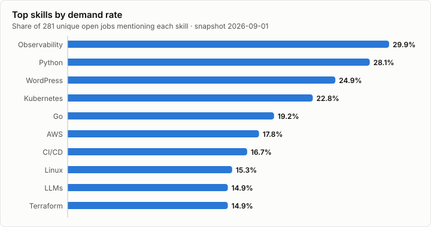
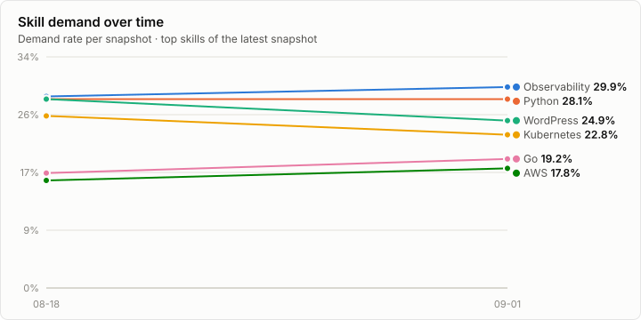
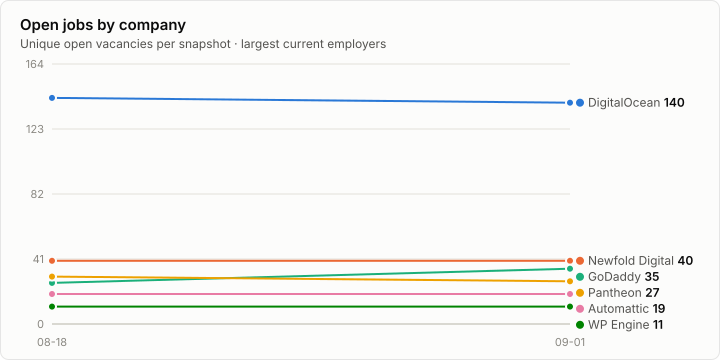

# Skills Watch: Managed WordPress Hosting

*Snapshot date: 2026-09-01 · 281 unique open jobs across 11 companies*

## Methodology

Public job postings were collected from official careers sources for 16 companies. Postings were deduplicated (stable ATS job IDs where available), and skills were matched against a curated taxonomy with alias normalisation. The headline metric is the **skill demand rate**: the percentage of unique analysed jobs that mention a skill — a job mentioning a skill many times still counts once. Job postings are hiring signals; they do not prove what technology a company runs in production, and collection failures are reported separately rather than counted as zero hiring.

## Collection Status

| Company | Status | Jobs | Source |
|---|---|---|---|
| WP Engine | success | 11 | workday |
| Automattic | success | 19 | automattic |
| Pressable | success | 2 | greenhouse |
| Pantheon | success | 27 | greenhouse |
| Kinsta | success | 1 | lever |
| SiteGround | success | 1 | lever |
| Liquid Web | no_open_jobs | 0 | generic |
| GoDaddy | success | 35 | greenhouse |
| DigitalOcean | success | 140 | greenhouse |
| Newfold Digital | success | 40 | workday |
| Rocket.net | success | 3 | workable |
| Servebolt | success | 2 | generic |
| GridPane | no_open_jobs | 0 | generic |
| Convesio | disabled | 0 | — |
| 10Web | no_open_jobs | 0 | bamboohr |
| WPX Hosting | no_open_jobs | 0 | generic |

## Top Skills

Share of all analysed jobs that mention each skill:

| Skill | Category | Jobs | Demand rate |
|---|---|---|---|
| Observability | Infrastructure | 84 | 29.9% |
| Python | Programming | 79 | 28.1% |
| WordPress | WordPress | 70 | 24.9% |
| Kubernetes | Infrastructure | 64 | 22.8% |
| Go | Programming | 54 | 19.2% |
| AWS | Cloud | 50 | 17.8% |
| CI/CD | Infrastructure | 47 | 16.7% |
| Linux | Infrastructure | 43 | 15.3% |
| LLMs | AI | 42 | 14.9% |
| Terraform | Infrastructure | 42 | 14.9% |
| Incident Response | Security | 40 | 14.2% |
| Google Cloud | Cloud | 39 | 13.9% |
| SQL | Data | 38 | 13.5% |
| Product Management | Business | 31 | 11.0% |
| Microsoft Azure | Cloud | 29 | 10.3% |
| MySQL | Data | 29 | 10.3% |
| Salesforce | Business | 28 | 10.0% |
| Customer Success | Business | 27 | 9.6% |
| Node.js | Programming | 26 | 9.3% |
| Account Management | Business | 24 | 8.5% |
| JavaScript | Programming | 24 | 8.5% |
| Docker | Infrastructure | 23 | 8.2% |
| Git | Infrastructure | 21 | 7.5% |
| Technical Support | Business | 21 | 7.5% |
| WooCommerce | WordPress | 21 | 7.5% |

## Top Technologies

| Technology | Category | Jobs | Demand rate |
|---|---|---|---|
| Observability | Infrastructure | 84 | 29.9% |
| Python | Programming | 79 | 28.1% |
| WordPress | WordPress | 70 | 24.9% |
| Kubernetes | Infrastructure | 64 | 22.8% |
| Go | Programming | 54 | 19.2% |
| AWS | Cloud | 50 | 17.8% |
| CI/CD | Infrastructure | 47 | 16.7% |
| Linux | Infrastructure | 43 | 15.3% |
| LLMs | AI | 42 | 14.9% |
| Terraform | Infrastructure | 42 | 14.9% |
| Incident Response | Security | 40 | 14.2% |
| Google Cloud | Cloud | 39 | 13.9% |
| SQL | Data | 38 | 13.5% |
| Microsoft Azure | Cloud | 29 | 10.3% |
| MySQL | Data | 29 | 10.3% |
| Node.js | Programming | 26 | 9.3% |
| JavaScript | Programming | 24 | 8.5% |
| Docker | Infrastructure | 23 | 8.2% |
| Git | Infrastructure | 21 | 7.5% |
| WooCommerce | WordPress | 21 | 7.5% |

## Hiring by Company

| Company | Open jobs | Top function | Top skills |
|---|---|---|---|
| DigitalOcean | 140 | Engineering | Kubernetes, Python, Observability, Go, LLMs |
| Newfold Digital | 40 | Other | WordPress, DNS, Observability, Technical Support, Account Management |
| GoDaddy | 35 | Infrastructure / SRE | Observability, AWS, Python, CI/CD, Incident Response |
| Pantheon | 27 | Engineering | WordPress, Google Cloud, Next.js, Python, AWS |
| Automattic | 19 | Sales | WooCommerce, WordPress, Salesforce, WordPress VIP, Customer Success |
| WP Engine | 11 | Sales | WordPress, Salesforce, AWS, CI/CD, Datadog |
| Rocket.net | 3 | Customer Support | Apache, CDN, Cloudflare, DNS, Linux |
| Pressable | 2 | Sales | Account Management, HubSpot, WooCommerce, WordPress |
| Servebolt | 2 | Finance | Apache, Ansible, Bash, CI/CD, DNS |
| Kinsta | 1 | Design | Product Management, WordPress |
| SiteGround | 1 | Design | — |

## Skills by Company

### DigitalOcean — 140 jobs

| Skill | Jobs | Demand rate |
|---|---|---|
| Kubernetes | 46 | 32.9% |
| Python | 45 | 32.1% |
| Observability | 44 | 31.4% |
| Go | 38 | 27.1% |
| LLMs | 29 | 20.7% |
| Linux | 27 | 19.3% |
| Incident Response | 25 | 17.9% |
| Terraform | 25 | 17.9% |

### Newfold Digital — 40 jobs

| Skill | Jobs | Demand rate |
|---|---|---|
| WordPress | 9 | 22.5% |
| DNS | 6 | 15.0% |
| Observability | 6 | 15.0% |
| Technical Support | 6 | 15.0% |
| Account Management | 5 | 12.5% |
| Customer Success | 5 | 12.5% |
| Linux | 5 | 12.5% |
| CI/CD | 4 | 10.0% |

### GoDaddy — 35 jobs

| Skill | Jobs | Demand rate |
|---|---|---|
| Observability | 18 | 51.4% |
| AWS | 15 | 42.9% |
| Python | 15 | 42.9% |
| CI/CD | 14 | 40.0% |
| Incident Response | 10 | 28.6% |
| Java | 7 | 20.0% |
| LLMs | 7 | 20.0% |
| Linux | 7 | 20.0% |

### Pantheon — 27 jobs

| Skill | Jobs | Demand rate |
|---|---|---|
| WordPress | 25 | 92.6% |
| Google Cloud | 11 | 40.7% |
| Next.js | 11 | 40.7% |
| Python | 11 | 40.7% |
| AWS | 9 | 33.3% |
| GraphQL | 8 | 29.6% |
| Observability | 8 | 29.6% |
| Terraform | 8 | 29.6% |

### Automattic — 19 jobs

| Skill | Jobs | Demand rate |
|---|---|---|
| WooCommerce | 19 | 100.0% |
| WordPress | 19 | 100.0% |
| Salesforce | 8 | 42.1% |
| WordPress VIP | 8 | 42.1% |
| Customer Success | 7 | 36.8% |
| PHP | 5 | 26.3% |
| Partnerships | 5 | 26.3% |
| Account Management | 4 | 21.1% |

### WP Engine — 11 jobs

| Skill | Jobs | Demand rate |
|---|---|---|
| WordPress | 11 | 100.0% |
| Salesforce | 5 | 45.5% |
| AWS | 2 | 18.2% |
| CI/CD | 2 | 18.2% |
| Datadog | 2 | 18.2% |
| Docker | 2 | 18.2% |
| Go | 2 | 18.2% |
| Google Cloud | 2 | 18.2% |

### Rocket.net — 3 jobs ⚠️ *small sample (3 jobs) — treat rates as indicative only*

| Skill | Jobs | Demand rate |
|---|---|---|
| Apache | 3 | 100.0% |
| CDN | 3 | 100.0% |
| Cloudflare | 3 | 100.0% |
| DNS | 3 | 100.0% |
| Linux | 3 | 100.0% |
| MySQL | 3 | 100.0% |
| Nginx | 3 | 100.0% |
| PHP | 3 | 100.0% |

### Pressable — 2 jobs ⚠️ *small sample (2 jobs) — treat rates as indicative only*

| Skill | Jobs | Demand rate |
|---|---|---|
| Account Management | 2 | 100.0% |
| HubSpot | 2 | 100.0% |
| WooCommerce | 2 | 100.0% |
| WordPress | 2 | 100.0% |

### Servebolt — 2 jobs ⚠️ *small sample (2 jobs) — treat rates as indicative only*

| Skill | Jobs | Demand rate |
|---|---|---|
| Apache | 2 | 100.0% |
| Ansible | 1 | 50.0% |
| Bash | 1 | 50.0% |
| CI/CD | 1 | 50.0% |
| DNS | 1 | 50.0% |
| Go | 1 | 50.0% |
| Incident Response | 1 | 50.0% |
| Linux | 1 | 50.0% |

### Kinsta — 1 jobs ⚠️ *small sample (1 jobs) — treat rates as indicative only*

| Skill | Jobs | Demand rate |
|---|---|---|
| Product Management | 1 | 100.0% |
| WordPress | 1 | 100.0% |

### SiteGround — 1 jobs ⚠️ *small sample (1 jobs) — treat rates as indicative only*

*No taxonomy skills detected in this company's postings.*

## Job Function Analysis

| Function | Jobs | Share |
|---|---|---|
| Engineering | 58 | 20.6% |
| Infrastructure / SRE | 38 | 13.5% |
| Sales | 31 | 11.0% |
| Security | 26 | 9.3% |
| Marketing | 23 | 8.2% |
| AI / Machine Learning | 21 | 7.5% |
| Other | 20 | 7.1% |
| Customer Support | 12 | 4.3% |
| Customer Success | 10 | 3.6% |
| Finance | 10 | 3.6% |
| Product | 9 | 3.2% |
| Operations | 6 | 2.1% |
| Design | 5 | 1.8% |
| Legal / Compliance | 5 | 1.8% |
| HR / People | 4 | 1.4% |
| Data / Analytics | 3 | 1.1% |

## Seniority Mix

| Level | Jobs | Share |
|---|---|---|
| Senior | 75 | 26.7% |
| Manager | 64 | 22.8% |
| Unknown | 53 | 18.9% |
| Lead / Staff | 43 | 15.3% |
| Director | 22 | 7.8% |
| Mid Level | 12 | 4.3% |
| Entry Level | 10 | 3.6% |
| Executive | 1 | 0.4% |
| Intern | 1 | 0.4% |

## Remote Work Analysis

| Arrangement | Jobs | Share |
|---|---|---|
| On-site | 217 | 77.2% |
| Remote | 43 | 15.3% |
| Unknown | 20 | 7.1% |
| Hybrid | 1 | 0.4% |

## Location Analysis

Coarse geography inferred from raw location text (raw text preserved in `jobs.csv`):

| Region | Jobs | Share |
|---|---|---|
| Other | 116 | 41.3% |
| India | 59 | 21.0% |
| United States | 39 | 13.9% |
| Unknown | 21 | 7.5% |
| Canada | 15 | 5.3% |
| APAC | 14 | 5.0% |
| Europe | 10 | 3.6% |
| Latin America | 5 | 1.8% |
| United Kingdom | 2 | 0.7% |

## Demand Over Time

## Changes Since Previous Snapshot (2026-08-18)

| Skill | Now | Then | Change |
|---|---|---|---|
| CI/CD | 16.7% | 13.5% | +3.2 pp |
| WordPress | 24.9% | 28.1% | -3.2 pp |
| JavaScript | 8.5% | 11.4% | -2.9 pp |
| Kubernetes | 22.8% | 25.6% | -2.8 pp |
| SEO | 0.4% | 3.2% | -2.8 pp |
| Go | 19.2% | 17.1% | +2.1 pp |
| Incident Response | 14.2% | 12.1% | +2.1 pp |
| Node.js | 9.3% | 11.4% | -2.1 pp |
| AWS | 17.8% | 16.0% | +1.8 pp |
| Product Management | 11.0% | 12.8% | -1.8 pp |

**Newly appearing skills:** Apache Kafka, Helm, Next.js, GitHub Actions, OpenTelemetry, SIEM, GraphQL, GDPR, Datadog, Jenkins, PCI DSS, ISO 27001, Argo CD, C#

> ⚠️ **These are not hiring trends.** All except C# were added to `taxonomy/skills.yml` during this run, so they read as 0% in the previous snapshot only because nothing was looking for them then. Their first comparable trend figure will be the next snapshot. C# is the one genuine new entrant (0.0% → 0.7%, 2 jobs).

**No longer appearing:** Content Marketing

## Notable Hiring Signals

- **CI/CD was the largest riser of the period**, appearing in 16.7% of vacancies (47 of 281 jobs) against 13.5% two weeks earlier — a +3.2 pp move that lifted it from 10th to 7th most-requested skill. Linux (+1.4 pp), AWS (+1.8 pp) and Incident Response (+2.1 pp, now 11th) moved the same direction, so the period's advertised demand leaned toward operational delivery and reliability rather than new application work.

- **WordPress-specific demand softened as a share of the sector**, down 3.2 pp to 24.9% (70 jobs) from 28.1%. It remains the third most-requested skill overall, and the fall is a mix-shift rather than a retreat: the two largest hirers in the sample (DigitalOcean and Newfold Digital, 180 of 281 jobs between them) advertise mostly general cloud and support roles, so their churn moves the sector-wide rate more than any WordPress-specific hiring does.

- **Kubernetes cooled by 2.8 pp to 22.8%** (64 jobs) but held 4th place, while Go rose 2.1 pp to 19.2% (54 jobs) and kept 5th. Both figures are dominated by DigitalOcean, where Kubernetes appears in 32.9% and Go in 27.1% of its 140 postings — read them as that one company's advertised platform stack more than a sector-wide signal.

- **AI-related demand eased slightly rather than accelerating.** LLMs slipped 1.5 pp to 14.9% (42 jobs, 6th to 9th) and Generative AI and RAG each edged down. Explicitly AI/ML-titled roles still account for 7.5% of all vacancies (21 jobs), 20 of them at DigitalOcean — so the sector's AI hiring signal is currently concentrated in a single infrastructure provider, not broad-based across managed WordPress hosts.

- **Pantheon's postings are the most WordPress-dense in the sample**, mentioning WordPress in 92.6% of its 27 jobs, alongside Next.js (40.7%) and GraphQL (29.6%). WP Engine (11 jobs) and Automattic (19 jobs) also mention WordPress in 100% of postings, but both skew to Sales as their top function — a reminder that a high WordPress rate can reflect commercial roles selling the platform as much as engineering roles building on it.

- **Headline job volume was flat at 281 for the second snapshot running, but the underlying postings turned over substantially.** DigitalOcean replaced 23 listings with 20 new ones, Newfold Digital cycled 18 of its 40, and GoDaddy added 17 against 8 removed to reach 35 (+35%). Kinsta (3→1) and SiteGround (2→1) both shrank; both were verified against their live boards and are genuine, but at one posting each no rate should be read from them.

## Data Quality and Limitations

- 11 of 16 companies collected successfully.
- Demand rates measure mentions in job postings, not production usage.
- Companies publishing one listing for several openings (or several listings for one opening) skew counts; stable ATS IDs limit but don't eliminate this.
- Large diversified companies (e.g. GoDaddy, DigitalOcean, Newfold) hire far beyond managed WordPress hosting; their postings reflect the whole business. DigitalOcean alone contributes 140 of 281 jobs (49.8%), so every sector-wide demand rate in this report is heavily weighted by one company.
- The skills taxonomy gained 13 entries this run (observability/CI-CD tooling, and security-compliance frameworks). Sector rates for those skills are therefore not comparable with the 2026-08-18 snapshot; all other rates are.
- Seniority labelling resolves "Senior <X> Manager" titles to *Manager*, so the Senior band (26.7%) understates senior individual-contributor demand. Left unchanged this run to preserve trend comparability.
- The four `no_open_jobs` companies (Liquid Web, GridPane, 10Web, WPX Hosting) returned reachable but empty boards; that is absence of advertised roles, not a collection failure.
